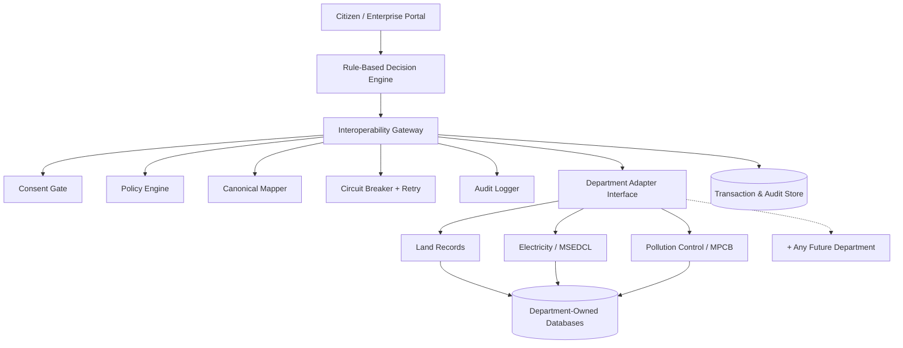

# 🏛️ Samanvay — Interoperability Platform

### One application. Every department.

**Samanvay** is a trust-aware, adapter-based interoperability layer that lets heterogeneous government systems communicate through a common model — without replacing their existing infrastructure.

Built for **Smart India Hackathon 2026**, addressing:
> *"System integration and interoperability among government digital platforms, resulting in fragmented service delivery"* — Government of Maharashtra, Maharashtra State Innovation Society


---

## 🎯 The Problem

A citizen setting up a project today has to separately visit the Land Revenue portal, the Electricity (MSEDCL) portal, and the Pollution Control Board (MPCB) — creating multiple accounts, repeatedly filling in the same information, and tracking each application independently. Departments don't talk to each other.

## ✨ The Samanvay Way

A citizen or organization logs in once, answers a short set of questions, and provides their reference numbers. Samanvay automatically routes the necessary data to every required department, enforces the real dependencies between them, and returns one unified status — while every department keeps full ownership of its own systems and data.

---

## 🚀 What Makes This Different

Most interoperability demos just call multiple APIs. Samanvay is built around problems that only show up when departments genuinely don't agree on anything:

- **🔄 Live Schema Adaptation** — When a department renames a field, an admin approves the new mapping and the platform adapts **at runtime**, with zero code deployment. Verified against a real, organically-discovered schema mismatch — not a staged demo.
- **🔗 Real Dependency Enforcement** — Downstream departments are never even contacted until upstream departments pass **full regulatory conditions** (mutation status, ownership validity, no encumbrance, no active court case) — not merely "a record exists."
- **🛡️ Resilient by Design** — A per-department circuit breaker with retry and backoff means one department's outage never crashes the whole application.
- **🔐 Consent-Gated, Audited Exchange** — Every cross-department data pull requires active, purpose-scoped consent, and every access is logged with masked PII.
- **🧩 Plug-and-Play Onboarding** — New departments connect through a standard adapter contract (`authenticate → request → transform`), never by touching the platform's core logic.
- **🌐 Bilingual, Accessible UI** — English/Marathi throughout, designed around GIGW accessibility principles.

---

## 🏗️ Architecture



Each department retains its own database — Samanvay never becomes a central data store. Onboarding a new department means implementing the adapter contract and approving a schema mapping, not modifying the gateway.

---

## 🧰 Tech Stack

| Layer | Technology |
|---|---|
| Citizen Portal | Node.js, Express |
| Interoperability Gateway | Python, FastAPI |
| Department Services | Mixed Express / FastAPI (deliberately heterogeneous) |
| Database | PostgreSQL, per-department isolation |
| Auth | JWT + OTP-based sessions |
| Schema Matching | Deterministic alias dictionary + similarity scoring — no live LLM calls in the critical path |

---

## 📦 Getting Started

### Prerequisites
- Node.js (v18+)
- Python (3.10+)
- PostgreSQL

### Installation

```bash
# Clone the repository
git clone https://github.com/<your-org>/samanvay.git
cd samanvay

# Install dependencies for each service
cd server && npm install && cd ..
cd interop_backend && pip install -r requirements.txt && cd ..
cd land_api && npm install && cd ..
cd electricity_department_api && pip install -r requirements.txt && cd ..
cd pollution_api && npm install && cd ..
```

### Configuration

Copy each service's `.env.example` to `.env` and fill in your local database credentials and service addresses:

```bash
cp interop_backend/.env.example interop_backend/.env
cp server/.env.example server/.env
# ...repeat for each service
```

### Run

```bash
node start-all.js
```

This starts every service together and verifies each one is healthy before continuing.

### Test

```bash
python e2e_test.py
```

Runs the full citizen journey end to end — registration through final verification.

---

## 📁 Project Structure

```
samanvay/
├── server/                       # Citizen-facing portal
├── interop_backend/              # Interoperability gateway (the core)
│   └── app/
│       ├── engine/                # Workflow, policy, mapper, circuit breaker
│       ├── routers/                # API endpoints
│       └── models/                  # Database models
├── land_api/                     # Land Records department (simulated)
├── electricity_department_api/   # MSEDCL department (simulated)
├── pollution_api/                # MPCB department (simulated)
├── rag-service/                  # Conversational intake (optional)
└── start-all.js                  # Orchestrated local startup
```

---

## 🗺️ Roadmap

Samanvay's prototype proves the hardest conceptual pieces — adaptive schema mapping, dependency-gated orchestration, consent enforcement — at working scale. The production path builds on research into real interoperability standards:

- **Decentralized trust** — per-department security connectors and a trust registry, so no single gateway holds every department's credentials
- **Signed, independently verifiable consent artifacts** and citizen-facing data-access history
- **Cross-platform discovery** — aligning our transaction lifecycle so other citizen-facing platforms can eventually discover and query connected departments

See `docs/research-and-references.md` for the full research foundation.

---

## 👥 Team

**Team {InterOps}** — Smart India Hackathon 2026

---

## 📄 License

This project is submitted as a prototype for Smart India Hackathon 2026. Licensing to be finalized post-submission.

---

<p align="center">
<i>Samanvay — because a citizen shouldn't need to know which department to visit.</i>
</p>
